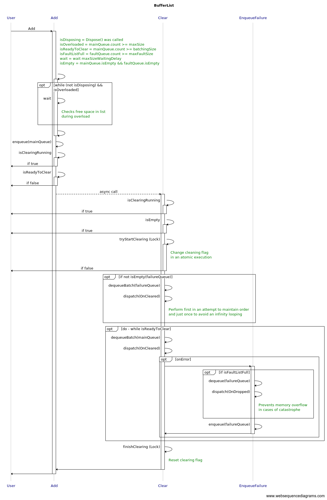

[](https://sonarcloud.io/dashboard?id=tiagor87_tr-bufferlist)
[](https://sonarcloud.io/dashboard?id=tiagor87_tr-bufferlist)
[](http://www.nuget.org/packages/TRBufferList.Core)

# BufferList

BufferList is a component that serves to store components and release them after a period of idle time or when reaching a predefined limit.

## Options

* **int** ClearBatchingSize: Maximum size of the list processed during cleaning
* **int** MaxSize: Maximum size allowed by the list
* **int** MaxFaultSize: Maximum size of the fault list
* **TimeSpan** IdleClearTtl: Expected time to perform cleaning when no items are added
* **TimeSpan** MaxSizeWaitingDelay: Waiting time in each scan iteration for processing when the list is overloaded
* **TimeSpan** DisposeTimeout: Maximum waiting time to perform a complete clean-up during disposal

## Flow



## Events

### Cleared

It is triggered in two scenarios:
* Whenever the batching size is reached;
* Whenever the list is not empty and is idle for the configured amount of time.

### Dropped

It is triggered when:
* The fault list is full and new items need to be added.

### Disposed

It is triggered when:
* The list is processing the disposal and the complete cleaning fails, so some items are still on the fault list.

## Failure recover

When an exception is thrown in the Cleared event, the items are added to a fault queue and, in each Clear, it tries to process the list again respecting the batching size.

## How to use

```c#
var options = new BufferListOptions(
    batchingSize: 100,
    maxSize: 200,
    maxFaultSize: 400,
    clearTtl: TimeSpan.FromSeconds(5),
    maxSizeWaitingDelay: TimeSpan.FromMilliseconds(10),
    disposeTimeout: TimeSpan.FromSeconds(5));
var list = new BufferList<int>(options);
list.Cleared += (items) => {
    // process cleared items
};
list.Dropped += (items) => {
    // process dropped items
};
list.Disposed += (items) => {
    // process faulted items
};

list.Add(1);
```

## Performance

Test on adding items.

* **Capacity (v0.0.6) | Batching size (v0.0.24):** 100
* **Clearing delay:** 250ms
* **Items:** 500

|        Method |            Mean |        Error |       StdDev |
|-------------- |----------------:|-------------:|-------------:|
| TRBufferList.Core |        11.06 us |     0.066 us |     0.051 us |
| BufferList v0.0.6 | 1,273,507.75 us | 6,843.318 us | 6,401.244 us |
